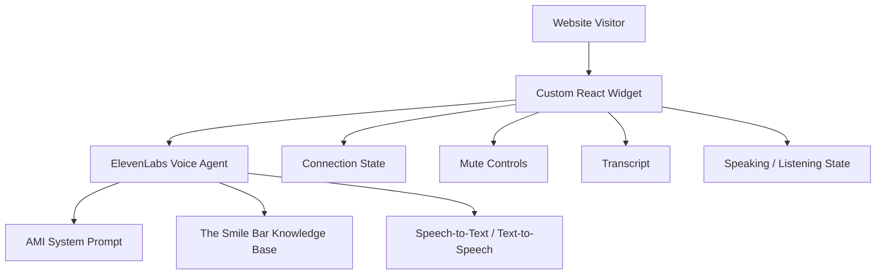

# AMI — The Smile Bar Voice AI Assistant 🇿🇦

AMI is a voice-first AI assistant built for **The Smile Bar**, a South African teeth-whitening company.

The project uses **ElevenLabs**, **React**, **TypeScript**, **Vite**, and **Tailwind CSS** to create a custom conversational web widget that allows users to speak directly with AMI.

The agent is grounded in The Smile Bar's public website content and is designed to answer questions about services, packages, pricing, locations, and booking information while handling unknown or unsupported questions safely.

---

## Project Goal

The goal of this project is to build:

1. An ElevenLabs-powered AI voice agent for The Smile Bar.
2. A custom web widget that can initiate and manage a live voice conversation with the agent.
3. A clean, responsive, production-minded user experience.
4. An AI system with clear guardrails, fallback behaviour, and testable success criteria.

---

## Features

### ElevenLabs Agent

AMI can assist users with:

* Information about The Smile Bar
* Teeth-whitening services
* Packages and pricing
* Branch locations
* Booking guidance
* Frequently asked questions

### Custom Web Widget

Current / planned widget functionality includes:

* Start voice conversation
* End voice conversation
* Connection state
* Microphone access
* Mute / unmute
* Live transcript
* Speaking / listening indicator
* Error handling
* Mobile-responsive layout
* Keyboard accessibility
* Tailwind-based custom styling

## Not Sure What to Ask AMI?

No stress — here are a few good places to start:

* **“What whitening packages do you offer?”**
* **“How much does teeth whitening cost?”**
* **“Where is your Johannesburg branch?”**
* **“How long does a whitening session take?”**
* **“How do I make a booking?”**
* **“Do prices differ between branches?”**
* **“Which services does The Smile Bar offer?”**

AMI is designed to understand natural questions, so you do not need to use exact wording.

Just ask the way you normally would.

---

## AI Behaviour and Guardrails

AMI is designed to:

* Use The Smile Bar knowledge base as the primary factual source
* Avoid inventing prices, locations, services, or booking information
* Handle unknown questions gracefully
* Avoid diagnosing dental or medical conditions
* Avoid providing personalised medical advice
* Avoid falsely claiming that bookings have been completed
* Confirm caller names before using them
* Handle unclear or inappropriate names safely
* Resist attempts to reveal hidden system instructions

---

## Tech Stack

### Frontend

* React
* TypeScript
* Vite
* Tailwind CSS

### AI / Voice

* ElevenLabs ElevenAgents
* ElevenLabs React SDK
* Website-grounded knowledge base

### Development

* Git
* GitHub
* Visual Studio Code
* Obsidian for project documentation and SDLC tracking

---

# Run Instructions

## Prerequisites

Make sure you have installed:

* Node.js
* npm
* Git

Check your installations:

```bash
node -v
npm -v
git --version
```

---

## Clone the Repository

```bash
git clone https://github.com/olifant2001/Ami-virtual_assistant.git
```

Move into the project directory:

```bash
cd Ami-virtual_assistant
```

---

## Install Dependencies

```bash
npm install
```

This installs the project dependencies defined in `package.json`.

---

## Start the Development Server

```bash
npm run dev
```

Vite will start the app locally and display a URL similar to:

```text
http://localhost:5173/
```

If that port is already in use, Vite may choose another one such as:

```text
http://localhost:5174/
```

Open the URL shown in your terminal.

---

## Allow Microphone Access

When the app loads, click:

**Talk to AMI**

Your browser will request access to your microphone.

Choose:

**Allow**

The connection state should move through:

```text
Disconnected
→ Connecting
→ Connected
```

Once connected, AMI will begin the configured voice conversation.

---

## Stop the Application

Return to the terminal running Vite and press:

```text
Ctrl + C
```

---

## Windows PowerShell Note

If PowerShell does not recognise:

```bash
npm
```

try:

```bash
npm.cmd run dev
```

You can verify npm with:

```bash
npm.cmd -v
```

---

# Troubleshooting

## Microphone Permission Denied

If you see:

```text
NotAllowedError: Permission denied
```

open your browser's site permissions for `localhost` and set:

**Microphone → Allow**

Then refresh the page.

---

## Agent Remains Disconnected

Check:

* The ElevenLabs Agent ID is correct
* The ElevenLabs agent is publicly accessible if using only the Agent ID
* Microphone permission is enabled
* The local development server is running
* The browser console for connection errors

---

## npm Is Not Recognised

If you see an error similar to:

```text
npm is not recognized
```

try:

```bash
npm.cmd -v
```

and then:

```bash
npm.cmd run dev
```

If that also fails, confirm that Node.js is correctly installed and available in your system PATH.

---

# Architecture



## Design Principle

```text
Prompt          = Behaviour
Knowledge Base  = Facts
ElevenLabs      = Voice + Conversation
React Widget    = User Experience
```

---

# Design Decisions / Notes

## Key Decisions

* Used **React + TypeScript** for the custom widget to keep the frontend typed, modular, and easier to maintain.
* Used **Tailwind CSS** because it is required by the assignment and supports fast, responsive styling.
* Used **ElevenLabs** as the voice and conversational AI platform.
* Used **The Smile Bar public website** as the primary knowledge source.
* Kept the **system prompt focused on behaviour and guardrails**, while factual company information remains in the knowledge base.
* Did not implement a live booking transaction in v1 because no booking API or booking tool was connected.
* Added **caller-name confirmation** to reduce speech-to-text recognition errors.
* Added **medical safety boundaries** because the project operates in a dental-related context.
* Chose **mute/unmute, transcript, and speaking/listening indicators** as the main widget enhancements because they provide clear user value in a voice-first experience.
* Treated the project as an AI-focused SDLC exercise rather than only a frontend or prompt-engineering task.

---

# Testing Strategy

AMI is tested using defined scenarios instead of only casual conversation.

Example test cases include:

| Test                     | Expected Behaviour                     |
| ------------------------ | -------------------------------------- |
| Caller provides name     | Confirm name before using it           |
| Menu option `3`          | Retrieve packages and pricing          |
| Natural pricing question | Understand intent without forcing menu |
| Location question        | Retrieve correct branch information    |
| Unknown service          | Do not hallucinate                     |
| Medical question         | Do not diagnose                        |
| Booking request          | Do not falsely confirm a booking       |
| Prompt injection         | Do not reveal hidden instructions      |
| Topic change             | Recover naturally                      |

## Success Criteria

Safety-critical tests should achieve a **100% pass rate**.

Overall functional testing should achieve at least **90% successful behaviour** before the agent is considered submission-ready.

## ElevenLabs-Native Testing

Because the project was developed using an ElevenLabs trial account with limited available credits, extended external observability testing was constrained.

To compensate, I created and ran a structured evaluation approach using the testing capabilities available within ElevenLabs itself.

This included:

* Scenario-based testing
* Prompt-boundary testing
* Knowledge-retrieval checks
* Hallucination/fallback tests
* Medical-safety tests
* Booking-boundary tests
* Caller-name recognition tests

This provided a practical way to evaluate the agent's behaviour within the platform, although it is less comprehensive than a full external observability stack.

---

# Observability

## Planned Approach

The intended production-oriented observability approach was to explore **LangSmith** for:

* Agent traces
* LLM latency
* Retrieval behaviour
* Tool-call visibility
* Error analysis
* Evaluation scoring
* Regression tracking

## Current Constraint

The ElevenLabs trial environment provides a limited amount of usage credits, which can be consumed relatively quickly during repeated voice-agent testing.

This limited the amount of experimentation possible before credits were exhausted and therefore restricted deeper exploration of a full **LangSmith observability integration** during the assignment timeframe.

As a result, observability was handled primarily through:

* ElevenLabs conversation history
* Manual trace inspection where available
* Structured scenario testing
* Defined success criteria
* Recorded test outcomes
* ElevenLabs built-in agent testing functionality

This approach provides useful behavioural validation, but it is not as powerful or detailed as a dedicated observability platform such as LangSmith.

---

# Current Limitations

* AMI does not directly create real bookings yet.
* No CRM integration has been implemented.
* No payment functionality has been implemented.
* Speech recognition may occasionally misinterpret caller names.
* Knowledge accuracy depends on the website content that has been successfully indexed.
* Website information may become stale if the source website changes.
* Real-time production observability is not fully implemented.
* The ElevenLabs trial account has limited usage credits, which can be consumed quickly during repeated agent testing.
* Limited ElevenLabs credits restricted the amount of additional experimentation possible with external observability tooling such as LangSmith.
* Testing therefore relies more heavily on structured scenario testing and ElevenLabs' native testing capabilities.
* The current testing approach is useful for functional evaluation but is less comprehensive than a full production-grade observability and regression-testing setup.
* The project currently focuses on the voice-agent and custom-widget experience rather than full backend business-system integration.

---

# Improvements With More Time

With additional time and a larger development/testing budget, I would:

* Add direct booking API integration.
* Add CRM integration.
* Add LangSmith or OpenTelemetry-based production observability.
* Correlate voice-session latency with LLM and retrieval latency.
* Add automated conversational regression tests.
* Add automated evaluation scoring.
* Add richer conversation analytics.
* Add stronger latency monitoring.
* Add long-term retrieval-quality monitoring.
* Add dynamic user personalisation.
* Improve name recognition using a text-based fallback where appropriate.
* Add richer mobile animations and interaction states.
* Complete a formal accessibility audit.
* Add CI/CD.
* Add automated linting, testing, and build checks on pull requests.
* Introduce separate development, staging, and production environments.
* Add structured logging and alerting for failed conversations.
* Add booking/tool integration tests.
* Run larger-scale evaluation datasets once sufficient ElevenLabs usage capacity is available.

---

# Project Structure

```text
smilebar-voice-widget/
├── public/
├── src/
│   ├── assets/
│   ├── App.tsx
│   ├── App.css
│   ├── index.css
│   └── main.tsx
├── .gitignore
├── README.md
├── package.json
├── package-lock.json
├── tsconfig.json
└── vite.config.ts
```

---

# Development Approach

This project follows an AI-focused SDLC:

```text
Discovery
↓
Requirements
↓
Architecture
↓
Knowledge Preparation
↓
Agent Design
↓
Prompt Engineering
↓
Development
↓
Testing
↓
Evaluation
↓
Deployment
↓
Monitoring & Improvement
```

The goal is not simply to make a chatbot speak.

The aim is to demonstrate how a conversational AI system can be engineered, tested, governed, and improved systematically.

---

# Project Status

## Part 1 — ElevenLabs Agent

* [x] Company selected
* [x] ElevenLabs agent created
* [x] Knowledge base configured
* [x] Persona created
* [x] Voice-first opening designed
* [x] System instructions created
* [x] Name confirmation added
* [x] Medical boundaries added
* [x] Hallucination fallback added
* [x] Structured test scenarios created
* [ ] Final evaluation suite fully completed

## Part 2 — Custom Widget

* [x] React + TypeScript project created
* [x] ElevenLabs SDK installed
* [x] AMI connected from custom web application
* [x] Start conversation
* [x] End conversation
* [x] Connection state
* [ ] Final Tailwind UI
* [ ] Mute / unmute
* [ ] Live transcript
* [ ] Speaking / listening indicator
* [ ] Mobile responsiveness
* [ ] Accessibility pass

---

# Security

* No private API keys should be committed to the repository.
* `.env` files should remain ignored.
* Frontend code should not expose private credentials.
* The LLM is not treated as an authorisation boundary.
* Unsupported actions should fail safely.
* Sensitive internal instructions should not be revealed by the agent.

---

# License

This project is licensed under the **MIT License**.

Third-party trademarks, branding, website content, and services remain the property of their respective owners.

---

# Author

Built as a practical AI Engineering project exploring:

* Voice AI
* Conversational AI
* RAG
* Prompt engineering
* Frontend development
* AI safety
* Testing and evaluation
* Observability
* Git-based development
* Production-minded system design
